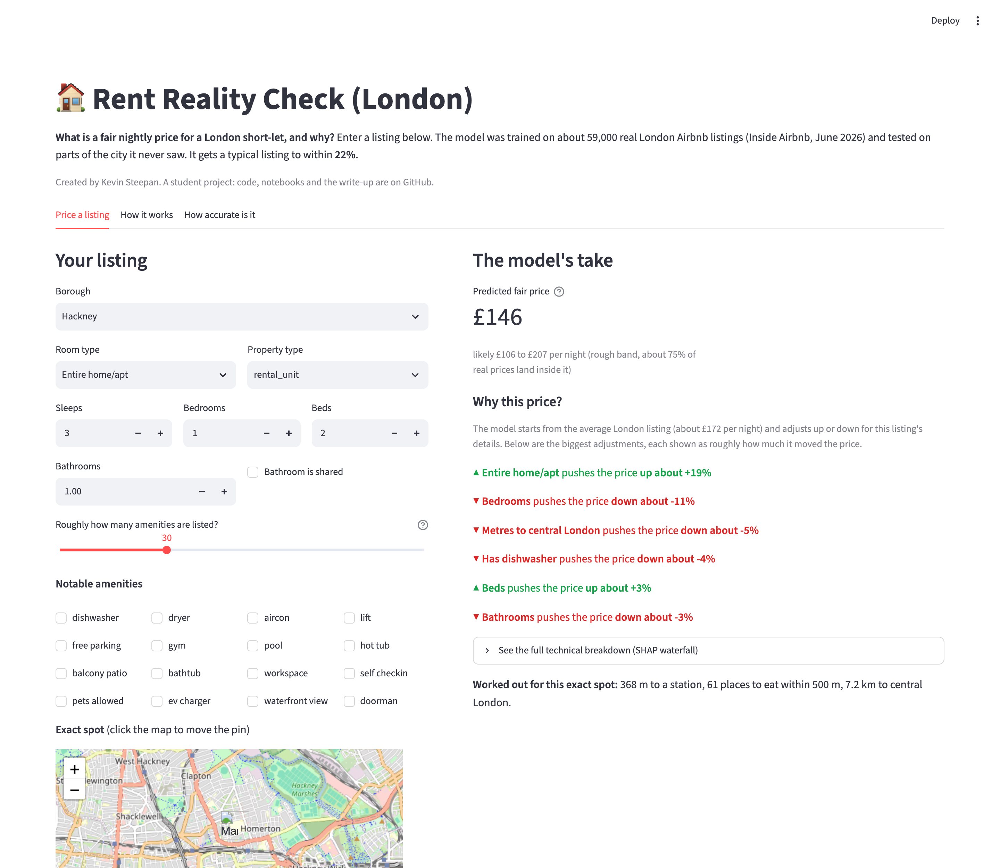
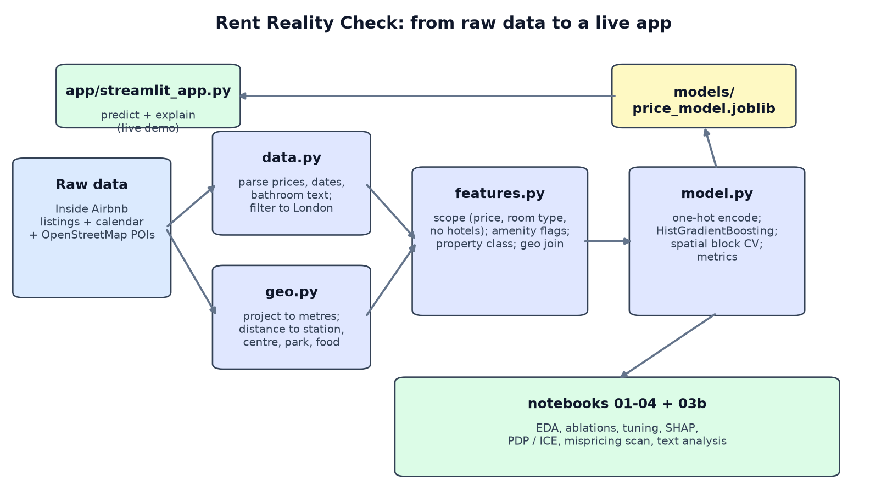

# Rent Reality Check (London)

Given a London short-let listing, predict a fair nightly price, explain the number,
and (next) show where that area's prices have been heading.

Created by **Kevin Steepan**.

[](https://github.com/KevST14/london-rent-reality-check/actions/workflows/ci.yml)
[](https://www.python.org/)
[](LICENSE)

**[Live demo](https://london-rent-reality-check-jikdwpaozdee8hvjjccgaa.streamlit.app)**
| **[One-page findings](FINDINGS.md)** |
notebooks: [EDA](notebooks/01_eda.ipynb),
[location features](notebooks/02_geo_features.ipynb),
[the model](notebooks/03_price_model.ipynb),
[text analysis](notebooks/04_text.ipynb)



## What this is

A student portfolio project built on real public data and a problem anyone can go
and check for themselves. It is meant to show the skills that turn into job
experience:

- framing a real question
- cleaning messy public data
- engineering features with a reason behind each one
- checking the work honestly instead of optimistically
- making the model explain itself

Every notebook is written to be read by someone with no ML background **and** by
someone who wants into the field:

- a plain walk-through of what each step does and why
- short "Deeper" sections for a reader learning ML: the concept, why it works, the
  trade-offs, what to try next
- a plain reading of every result, then a deeper note
- a "where this comes from" pointer to the common public source for each technique
- code comments that say how the code was arrived at: what was tried, what broke,
  why this choice

**Status:** price model, explanations, and the text analysis are done. The
long-run time-series notebook and the write-up are next.

## The notebooks

| Notebook | Question | Headline result |
|---|---|---|
| [`01_eda`](notebooks/01_eda.ipynb) | What are we predicting, on which listings, and what is the score to beat? | Target is `log(price)`. Scope is £10 to £1000 per night, whole homes and private rooms, no hotel rooms. No-model baseline: about **£90 mean error, R-squared 0.49**. |
| [`02_geo_features`](notebooks/02_geo_features.ipynb) | Does the exact spot matter, beyond the borough label? | Yes. Six OpenStreetMap features (distance to Tube, centre, food, park) lift R-squared from 0.62 to **0.65** and cut error from £78 to **£72**. |
| [`03_price_model`](notebooks/03_price_model.ipynb) | Build, check, tune, and explain the real model. | Held-out test: about **£60 mean error, 22% median error, R-squared 0.72**. Beats a linear baseline by about £8. SHAP explains every prediction. |
| [`04_text`](notebooks/04_text.ipynb) | Does the wording of the description predict price on top of the facts? | Barely. Text alone reaches R-squared 0.46, but on top of the facts it adds only about **£1 to £2 per night**. A useful negative result: the app keeps the facts-only model. Marketing words do track price (correlation 0.24). |
| [`03b_model_deep_dives`](notebooks/03b_model_deep_dives.ipynb) | What shapes did the model learn, and which listings does it most disagree with? | Partial-dependence and ICE plots for the top features, plus a scan of the listings the model calls overpriced or a bargain. |
| `05` (planned) | Where have London prices been heading over 25 years? | To do |

The reasoning, including the decisions that changed mid-project and the things
that did not work, is written up in **[`FINDINGS.md`](FINDINGS.md)**.



## Live demo

[`app/streamlit_app.py`](app/streamlit_app.py) has three tabs:

- **Price a listing:** a prediction, a plain verdict on a price you enter, and a
  breakdown of the biggest factors that moved the price
- **How it works:** the five-step method in plain language
- **How accurate is it:** the held-out test numbers

```bash
uv sync                                        # set up the environment
make data                                      # download the Inside Airbnb snapshot
make notebooks                                 # run all four notebooks in order
make app                                       # launch the demo
make test                                      # run the tests
make help                                      # list every target
```

Raw data is git-ignored, so a fresh clone needs `make data` before `make
notebooks`. The OpenStreetMap extracts and the trained model are committed, so the
app runs straight after `uv sync`.

## The method

**What we model.**

- Nightly price is lopsided: most listings are £80 to £250, with a thin tail past
  £1000. So we predict `log(price)`.
- Logging makes the model's errors read as percentages ("about 15% too high"),
  which is how anyone thinks about price, and stops a few huge listings dominating.
- We keep listings priced £10 to £1000 that are whole homes or private rooms, and
  drop about 1,200 hotel rooms sold through Airbnb (they price like hotels).
- A third of listings have no price, and that gap is not random (it varies by area
  and room type), so the model is described honestly as being about listings that
  publish a price.

**How location is handled.**

- The borough is a blunt tool. "Camden" covers a flat on top of a station and a
  house 25 minutes' walk from one.
- We pull stations, parks, and food venues from OpenStreetMap and, for each
  listing, compute distance to the nearest one plus counts within a radius, and
  distance to Charing Cross.
- All distances are computed in real metres. You cannot measure metres on raw
  latitude and longitude, because near London 1 degree east and 1 degree north are
  different distances on the ground, so the coordinates are projected onto the
  British National Grid first.

**The model and how it is checked.**

- A gradient-boosted tree (`HistGradientBoostingRegressor`): hundreds of small
  trees, each fixing the last one's mistakes.
- It handles missing values itself, so we do not fill in `bedrooms` or
  `review_scores`.
- It is checked with spatial cross-validation: hold out whole 2 km blocks of
  London, not random rows, because nearby listings are near-twins and random
  splits let the model study its own test.
- It beats a linear baseline by a clear margin (price depends on interactions that
  trees capture for free). Light hyperparameter tuning did not improve it, and
  that is reported as-is.

**Explaining predictions.**

- A single accuracy number does not tell a host why their listing was priced at
  £140. SHAP does.
- It splits each prediction into per-feature contributions ("plus £30 for the
  borough, minus £15 for no dishwasher") that add up exactly to the number.
- SHAP values come from cooperative game theory (Shapley, 1953). Lundberg and Lee
  (2017) applied them to ML with an exact fast algorithm for tree models.

**Honesty.**

- The model under-prices the luxury tail, and the £1000 price cap still produces
  edge cases (a one-person flat priced like a luxury home).
- It is weakest in thinly-sampled outer boroughs.
- It ships without review scores so it can price brand-new listings. That choice
  costs about £6.50 per night of accuracy, which is measured, not hidden.

## Data

See [`data/README.md`](data/README.md). Two sources:

- **Inside Airbnb (London)**, snapshot 19 June 2026: listings, descriptions,
  coordinates, and the forward-availability calendar. Git-ignored, re-downloadable.
- **OpenStreetMap** extracts (stations, parks, food venues), committed to the repo
  as GeoPackages (ODbL, OpenStreetMap contributors) so the notebooks reproduce
  without hitting the Overpass API.
- Planned: Kaggle `justinas/housing-in-london` for the 25-year borough price trend
  (notebook 05).

## Layout

```
FINDINGS.md      one-page write-up: the question, what turned up, what did not work
Makefile         make data | notebooks | app | test | diagram | ...
data/            raw -> clean -> interim -> feature-engineered  (git-ignored; OSM extracts kept)
notebooks/       01-04 the narrative; 03b PDP/ICE + the mispricing scan
src/londonrent/  reusable code
    data.py        load and clean the Inside Airbnb snapshot
    geo.py         lat/long -> location features (with the projection explanation)
    features.py    assemble the model table (amenities, property type, scope)
    model.py       encoding, the estimator, spatial CV, metrics, save/load
    text.py        description cleaning and the hand-crafted style features
app/             the Streamlit demo
models/          the saved model the app loads
tests/           pytest tests for the src package
scripts/         screenshot.py and pipeline_diagram.py regenerate the docs/ images
docs/            the app screenshot and the pipeline diagram
```

## A note on the citations

The notebooks point techniques at widely-used public sources: An Introduction to
Statistical Learning (ISLR), Geron's Hands-On Machine Learning, StatQuest,
Christoph Molnar's Interpretable Machine Learning, the scikit-learn user guide, and
a few papers. 